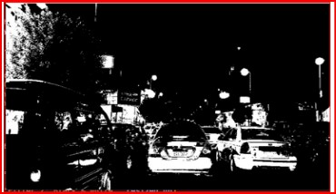
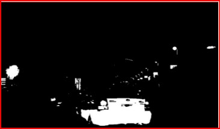

# Visual Complexity Measurement.
This app has been developed by Ahmed Rodriguez as a final project for Human-Computer Interaction course at Örebro University. The source code will be hidden for now.

## What the app does 
This application meaure the visual complexity for images based on two important topic. The first topic is the number of colors that has been used in the image. The second topic is the number of object that will be detected in the image. 

## The application input 
The input of the app is either one single image, or a sequence of images that will maybe exist in one folder or distributed in multiple folders.

The app can in an indirect way mesure the complexity for videos, but in this case the user will need to convert the video to frames and input this frames as sequence of images.

## The output:
1. Case 1, one single image as input: The output in that case will be two numbers that represent the color and object complexity for that image. An image will may be showed that represent the application vision for that image. 

2. Case 2, sequence of images: the output in that case is two different figures. They represent how the visual complexity variates through the whole video. Some additional information will be showed up in the boxes for ex. which frame has MAX vs MIN complexity etc. <br>
**->** The figures does not only inform the user how complexity variates, but it also shows where do exactly we have something interesting,or an interesting, dangerous or strange scene, that is happening in the background of the video. For example: By looking at the figures and see where exactly in the video the line of the curve goes up then there are something interesting to investigate in the video.

## The logic behind the app.
The application does not use any kind of AI of Machine learning but instead some python libraries that help to solve the problem in the simplest and fastest way. That is why the result will be showed up to the user in a very fast way.<br>


### How my app UI is 


### Mesure complecity for single image & show computer vision image


### Mesure complecity for sequence of images & show colors vs objects complexity figures


### Plot to show how visual complexity variates between sequence of images


### ex:1 original image:


### Computer vision for the previous image (ex:1)


### ex:2 original image:


### Computer vision for the previous image (ex:2)



# dependency:
1. cv2, to install:  ```pip install opencv-python```
3. numpy, to install: ```pip install numpy```
2. PyQt5, to install: ```pip install PyQt5```